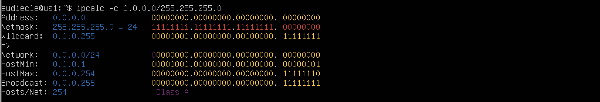
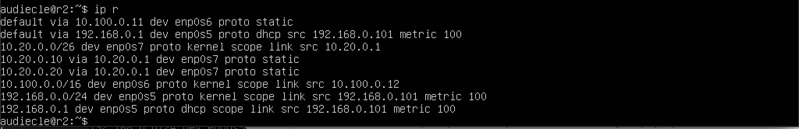

## Part 1. Инструмент ipcalc

### 1.1. Сети и маски

1. Адрес сети 192.167.38.54/13
Network: 192.160.0.0/13

2. Перевод маски 255.255.255.0 в префиксную и двоичную запись, /15 в обычную и двоичную, 11111111.11111111.11111111.11110000 в обычную и префиксную

3. Минимальный и максимальный хост в сети 12.167.38.4 при масках: /8, 11111111.11111111.00000000.00000000, 255.255.254.0 и /4

### 1.2. localhost

Интерфейс loopback может быть использован сетевым клиентским программным обеспечением, чтобы общаться с серверным приложением, расположенным на том же компьютере.
Можно обратиться к приложению, работающему на localhost, со следующими IP: 127.0.0.2, 127.1.0.1 т.к. есть интерфейс loopback.
У IP 194.34.23.100, 128.0.0.1 нет интерфейса loopback.

### 1.3. Диапазоны и сегменты сетей

1) какие из перечисленных IP можно использовать в качестве публичного, а какие только в качестве частных: 

    | IPs | public or private |
    |---------------|:-------:|
    | 10.0.0.45 | Private |
    | 134.43.0.2 | Public |
    | 192.168.4.2 | Private |
    | 172.20.250.4 | Private |
    | 172.0.2.1 | Public |
    | 192.172.0.1 | Public |
    | 172.68.0.2 | Public |
    | 172.16.255.255 | Private |
    | 10.10.10.10 | Private |
    | 192.169.168.1 | Public |

2) какие из перечисленных IP адресов шлюза возможны у сети 10.10.0.0/18: 
* 10.0.0.1 - невозможен
* 10.10.0.2  - возможен
* 10.10.10.10  - возможен
* 10.10.100.1  - невозможен
* 10.10.1.255  - возможен

## Part 2. Статическая маршрутизация между двумя машинами

С помощью команды ip a посмотреть существующие сетевые интерфейсы

Описать сетевой интерфейс, соответствующий внутренней сети, на обеих машинах и задать следующие адреса и маски: ws1 - 192.168.100.10, маска /16, ws2 - 172.24.116.8, маска /12

Выполнить команду netplan apply для перезапуска сервиса сети

### 2.1. Добавление статического маршрута вручную

### 2.2. Добавление статического маршрута с сохранением

## Part 3. Утилита iperf3

### 3.1. Скорость соединения

* 8 Mbps = 1 MB/s
* 100 MB/s = 800000 Kbps
* 1 Gbps = 1000 Mbps

### 3.2. Утилита iperf3

Измерить скорость соединения между ws1 и ws2

## Part 4. Сетевой экран

### 4.1. Утилита iptables

Создать файл /etc/firewall.sh, имитирующий фаерволл, на ws1 и ws2:
1) На ws1 применить стратегию когда в начале пишется запрещающее правило, а в конце пишется разрешающее правило (это касается пунктов 4 и 5)
2) На ws2 применить стратегию когда в начале пишется разрешающее правило, а в конце пишется запрещающее правило (это касается пунктов 4 и 5)
3) Открыть на машинах доступ для порта 22 (ssh) и порта 80 (http)
4) Запретить echo reply (машина не должна "пинговаться”, т.е. должна быть блокировка на OUTPUT)
5) Разрешить echo reply (машина должна "пинговаться")

Запустить файлы на обеих машинах командами chmod +x /etc/firewall.sh и /etc/firewall.sh

### 4.2. Утилита nmap   

## Part 5. Статическая маршрутизация сети

### 5.1. Настройка адресов машин

Настроить конфигурации машин в etc/netplan/00-installer-config.yaml согласно сети на рисунке.

Перезапустить сервис сети. Если ошибок нет, то командой ip -4 a проверить, что адрес машины задан верно. Также пропинговать ws22 с ws21. Аналогично пропинговать r1 с ws11.

### 5.2. Включение переадресации IP-адресов

Для включения переадресации IP, выполните команду на роутерах:

Откройте файл /etc/sysctl.conf и добавьте в него следующую строку:

### 5.3. Установка маршрута по-умолчанию

Настроить маршрут по-умолчанию (шлюз) для рабочих станций. Для этого добавить default перед IP роутера в файле конфигураций

Вызвать ip r и показать, что добавился маршрут в таблицу маршрутизации

Пропинговать с ws11 роутер r2 и показать на r2, что пинг доходит. Для этого использовать команду:

### 5.4. Добавление статических маршрутов

Добавить в роутеры r1 и r2 статические маршруты в файле конфигураций. 

Вызвать ip r и показать таблицы с маршрутами на обоих роутерах. 

Запустить команды на ws11: ip r list 10.10.0.0/[маска сети] и ip r list 0.0.0.0/0

*Для интерфейса 10.10.0.0 не нужна маршрутизация. 0.0.0.0 - это любой интерфейс, но для того, чтобы связаться с другой сетью машиной используется адрес 10.10.0.2
### 5.5. Построение списка маршрутизаторов

Запустить на r1 команду дампа: tcpdump -tnv -i eth0

При помощи утилиты traceroute построить список маршрутизаторов на пути от ws11 до ws21

Traceroute — это команда, которая позволяет проследить маршрут следования данных до удалённого адресата 
### 5.6. Использование протокола ICMP при маршрутизации

Запустить на r1 перехват сетевого трафика, проходящего через eth0 с помощью команды: tcpdump -n -i eth0 icmp

Пропинговать с ws11 несуществующий IP (например, 10.30.0.111) с помощью команды: ping -c 1 10.30.0.111

## Part 6. Динамическая настройка IP с помощью DHCP

Для r2 настроить в файле /etc/dhcp/dhcpd.conf конфигурацию службы DHCP:

в файле resolv.conf прописать nameserver 8.8.8.8

Перезагрузить службу DHCP командой systemctl restart isc-dhcp-server. Машину ws21 перезагрузить при помощи reboot и через ip a показать, что она получила адрес. Также пропинговать ws22 с ws21.

Указать MAC адрес у ws11, для этого в etc/netplan/00-installer-config.yaml надо добавить строки: macaddress: 10:10:10:10:10:BA, dhcp4: true

Для r1 настроить аналогично r2, но сделать выдачу адресов с жесткой привязкой к MAC-адресу (ws11). Провести аналогичные тесты:

Запросить с ws21 обновление ip адреса

* dhclient -r
* dhclient -v

## Part 7. NAT

В файле /etc/apache2/ports.conf на ws22 и r1 изменить строку Listen 80 на Listen 0.0.0.0:80, то есть сделать сервер Apache2 общедоступным

Запустить веб-сервер Apache командой service apache2 start на ws22 и r1

Добавить в фаервол, созданный по аналогии с фаерволом из Части 4, на r2 следующие правила:
1) удаление правил в таблице filter - iptables -F
2) удаление правил в таблице "NAT" - iptables -F -t nat
3) отбрасывать все маршрутизируемые пакеты - iptables --policy FORWARD DROP

Проверить соединение между ws22 и r1 командой ping

Добавить в файл ещё одно правило:

4) разрешить маршрутизацию всех пакетов протокола ICMP

Проверить соединение между ws22 и r1 командой ping

Добавить в файл ещё два правила:

5) включить SNAT, а именно маскирование всех локальных ip из локальной сети, находящейся за r2 (по обозначениям из Части 5 - сеть 10.20.0.0)
6) включить DNAT на 8080 порт машины r2 и добавить к веб-серверу Apache, запущенному на ws22, доступ извне сети

Запускать файл также, как в Части 4

Проверить соединение по TCP для SNAT, для этого с ws22 подключиться к серверу Apache на r1 командой: telnet [адрес] [порт]

Проверить соединение по TCP для DNAT, для этого с r1 подключиться к серверу Apache на ws22 командой telnet (обращаться по адресу r2 и порту 8080)

## Part 8. Дополнительно. Знакомство с SSH Tunnels

Запустить на r2 фаервол с правилами из Части 7

Запустить веб-сервер Apache на ws22 только на localhost (то есть в файле /etc/apache2/ports.conf изменить строку Listen 80 на Listen localhost:80)

Воспользоваться Local TCP forwarding с ws21 до ws22, чтобы получить доступ к веб-серверу на ws22 с ws21

Воспользоваться Remote TCP forwarding c ws11 до ws22, чтобы получить доступ к веб-серверу на ws22 с ws11

Для проверки, сработало ли подключение в обоих предыдущих пунктах, перейдите во второй терминал (например, клавишами Alt + F2) и выполните команду:
telnet 127.0.0.1 [локальный порт]

[def]: ../src/images/Part7.11.png
